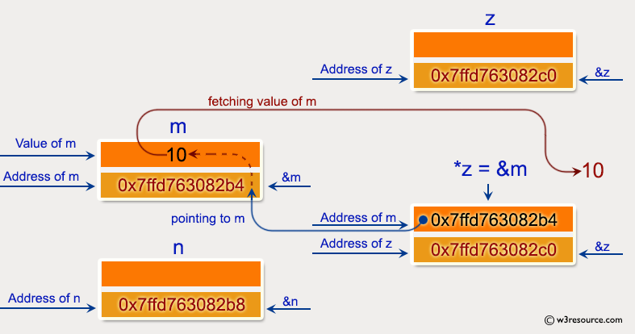
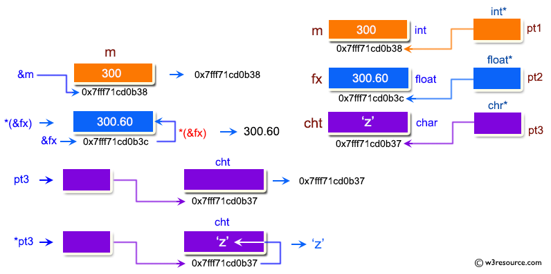

## Esercizi C (Puntatori)

Si propone un gruppo di esercizi per approfondire l'utilizzo dei riferimenti a locazioni di memoria (puntatori).

---

Esercizio 1. Scrivere un programma per mostrare la dichiarazione base di un puntatore.



---

Esercizio 2. Scrivere un programma per dimostrare come gestire i puntatori in un programma.


---

Esercizio 3. Scrivere un programma per dimostrare l'uso degli operatori `&(indirizzo di)` e `*(valore all'indirizzo)`.



---

Esercizio 4. Scrivere una funzione per sommare numeri utilizzando l'input da console ed il passaggio dei parametri per riferimento.

La funzione deve rispettare il seguente prototipo:

```c
long addTwoNumbers(long *n1, long *n2);
```

dove:

* **n1** e **n2** sono i puntatori agli addendi;
* la funzione ritorna il risultato della somma.


---

Esercizio 5. Scrivere una funzione per calcolare la lunghezza di una stringa usando il suo puntatore.

La funzione deve rispettare il seguente prototipo:

```c
int calculateLength(char* ch)
```

dove:

* **ch** è il puntatore al primo carattere della stringa;
* la funzione ritorna la lunghezza della stringa.


---

Esercizio 6. Scrivere un programma per dimostrare l'uso dei puntatori alle strutture.


---

Esercizio 7. Scrivere un programma per mostrare un puntatore a un array i cui contenuti sono puntatori a strutture.


