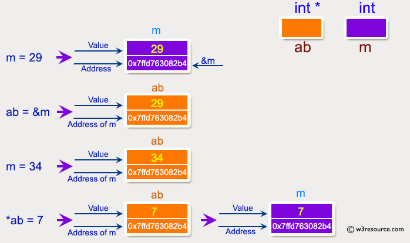
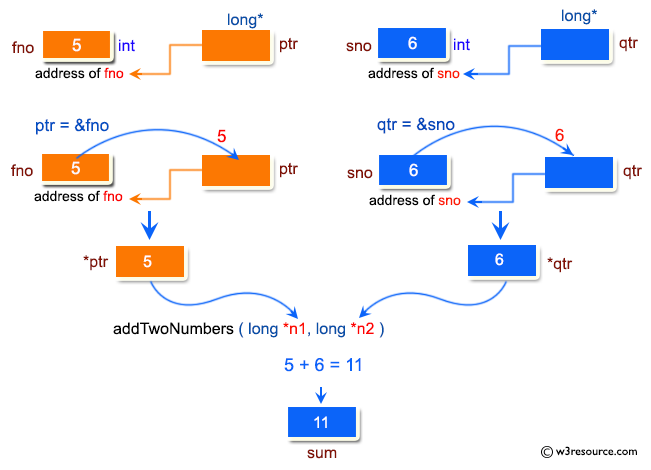
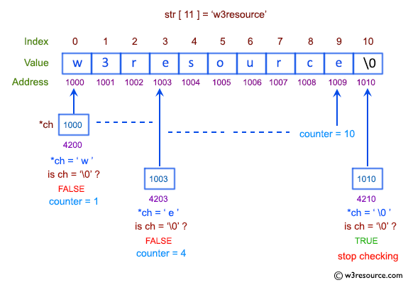
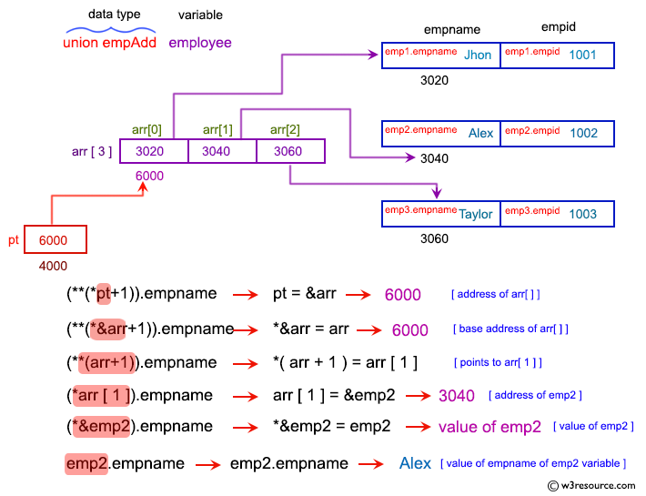

## Esercizi C (Puntatori)

Si propone un gruppo di esercizi per approfondire l'utilizzo dei riferimenti a locazioni di memoria (puntatori).

---

Esercizio 1. Scrivere un programma per mostrare la dichiarazione base di un puntatore.


```c
#include <stdio.h>

int main(void)
{
    int m = 10, n, o;
    int *z = &m; // Dichiara un puntatore a intero z e gli assegna l'indirizzo di m

    // Stampa le informazioni di base su puntatori e variabili
    printf("\n\n Puntatore: mostra la dichiarazione di base del puntatore :\n");
    printf("-------------------------------------------------------\n");
    printf(" m=10, n e o sono due variabili integer e *z è un integer");
    printf("\n\n z memorizza l'indirizzo di m  = %p\n", z); // Stampa l'indirizzo memorizzato in z utilizzando %p
    printf("\n *z memorizza il valore di m = %d\n", *z); // Stampa il valore puntato da z utilizzando *z
    printf("\n &m memorizza l'indirizzo di m = %p\n", &m); // Stampa l'indirizzo di m usando &m
    printf("\n &n memorizza l'indirizzo di n = %p\n", &n); // Stampa l'indirizzo di n usando &n
    printf("\n &o memorizza l'indirizzo di o = %p\n", &o); // Stampa l'indirizzo di o usando &o
    printf("\n &z memorizza l'indirizzo di z = %p\n\n", &z); // Stampa l'indirizzo di z usando &z
}
```

---

Esercizio 2. Scrivere un programma per dimostrare come gestire i puntatori in un programma.



```c
#include <stdio.h>

int main()
{
    int* ab; // Dichiara un puntatatore ad intero ab
    int m;   // Diachiara una variabile di tipo integer m

    m = 29; // Assegna il valore 29 alla variabile m

    printf("\n\n Puntatore : come gestire i puntatori :\n");
    printf("------------------------------------------------------------\n");
    printf(" Indirizzo di m : %p\n", &m); // Stampa l'indirizzo della variabile m
    printf(" Valore di m : %d\n\n", m); // Stampa il valore della variabile m

    ab = &m; // Assegna l'indirizzo di m al puntatore ab

    printf(" Indirizzo del puntatore ab : %p\n", ab);      // Stampa l'indirizzo memorizzato nel puntatore ab
    printf(" Contenuto del puntatore ab : %d\n\n", *ab);   // Stampa il valore riferito da ab

    m = 34; // Assegna il valore 34 alla variabile m

    printf(" Indirizzo del puntatore ab : %p\n", ab);      // Stampa l'indirizzo memorizzato nel puntatore ab
    printf(" Contenuto del puntatore ab : %d\n\n", *ab);   // Stampa il valore riferito da ab

    *ab = 7; // Assegna il valore 7 alla variabile puntata da ab

    printf(" Indirizzo di m : %p\n", &m);               // Stampa l'indirizzo della variabile m
                                                        // siccome ab contiene l'indirizzo di m
                                                        // *ab ha cambiato il valore di m ed ora è diventato 7
    printf(" Valore di m : %d\n\n", m);                 // Stampa il valore della variabile m

    return 0;
}
```

---

Esercizio 3. Scrivere un programma per dimostrare l'uso degli operatori `&(indirizzo di)` e `*(valore all'indirizzo)`.


```c
#include <stdio.h>

int main()
{
    int m = 300;     // Dichiara e inizializza una variabile intera m
    float fx = 300.60;  // Dichiara e inizializza una variabile float fx
    char cht = 'z';  // Dichiara e inizializza una variabile char cht

    int *pt1;     // Dichiara un puntatore a intero pt1
    float *pt2;   // Dichiara un puntatore a float pt2
    char *pt3;    // Dichiara un puntatore a char pt3

    pt1 = &m;     // Assegna l'indirizzo di m al puntatore pt1
    pt2 = &fx;    // Assegna l'indirizzo di fx al puntatore pt2
    pt3 = &cht;   // Assegna l'indirizzo di cht al puntatore pt3

    printf(" m = %d\n", m);       // Stampa il valore di m
    printf(" fx = %f\n", fx);     // Stampa il valore di fx
    printf(" cht = %c\n", cht);   // Stampa il valore di cht

    printf("\n Usando l'operatore & :\n");
    printf("-----------------------\n");
    printf(" indirizzo di m = %p\n", &m);   // Stampa l'indirizzo di m
    printf(" indirizzo di fx = %p\n", &fx); // Stampa l'indirizzo di fx
    printf(" indirizzo di cht = %p\n", &cht); // Stampa l'indirizzo di cht

    printf("\n Usando gli operatori & e * :\n");
    printf("-----------------------------\n");
    printf(" value at indirizzo di m = %d\n", *(&m));   // Stampa il valore all'indirizzo di m
    printf(" value at indirizzo di fx = %f\n", *(&fx)); // Stampa il valore all'indirizzo di fx
    printf(" value at indirizzo di cht = %c\n", *(&cht)); // Stampa il valore all'indirizzo di cht

    printf("\n Usando solo le variabili puntatore :\n");
    printf("----------------------------------\n");
    printf(" indirizzo di m = %p\n", pt1);  // Stampa l'indirizzo memorizzato in pt1
    printf(" indirizzo di fx = %p\n", pt2); // Stampa l'indirizzo memorizzato in pt2
    printf(" indirizzo di cht = %p\n", pt3); // Stampa l'indirizzo memorizzato in pt3

    printf("\n Usando solo gli operatori dei puntatori :\n");
    printf("----------------------------------\n");
    printf(" value at indirizzo di m = %d\n", *pt1); // Stampa il valore puntato da pt1
    printf(" value at indirizzo di fx= %f\n", *pt2); // Stampa il valore puntato da pt2
    printf(" value at indirizzo di cht= %c\n\n", *pt3); // Stampa il valore puntato da pt3
}
```

---

Esercizio 4. Scrivere una funzione per sommare numeri utilizzando l'input da console ed il passaggio dei parametri per riferimento.

La funzione deve rispettare il seguente prototipo:

```c
long addTwoNumbers(long *n1, long *n2);
```

dove:

* **n1** e **n2** sono i puntatori agli addendi;
* la funzione ritorna il risultato della somma.



---

Esercizio 5. Scrivere una funzione per calcolare la lunghezza di una stringa usando il suo puntatore.

La funzione deve rispettare il seguente prototipo:

```c
int calculateLength(char* ch)
```

dove:

* **ch** è il puntatore al primo carattere della stringa;
* la funzione ritorna la lunghezza della stringa.



---

Esercizio 6. Scrivere un programma per dimostrare l'uso dei puntatori alle strutture.


```c
#include <stdio.h>

// Definizione di una struttura per memorizzare i dati di un dipendente
struct empAddress {
    char *ename;        // Nome dipendente (string pointer)
    char stname[20];    // Indirizzo (array di caratteri)
    int pincode;        // Pincode (integer)
}
// Inizializzazione della struttura
struct empAddress employee = {"John Alter", "Court Street \n", 654134};
struct empAddress *pt = &employee;

int main() {
    printf(" %s from %s \n\n", pt->ename, (*pt).stname);
    return 0;
}
```

---

Esercizio 7. Scrivere un programma per mostrare un puntatore a un array i cui contenuti sono puntatori a strutture.




```c
#include <stdio.h>

// Definizione di una struttura per memorizzare i dati di un dipendente
struct employee {
    char *empname;  // Nome dipendente (string pointer)
    int empid;      // ID dipendente (integer)
};

int main() {

    // Inizializzazione delle strutture con i valori
    static struct employee emp1 = {.empname="John", .empid=1001}, emp2 = {.empname="Alex", .empid=1002}, emp3 = {.empname="Taylor", .empid=1003};

    // Creazione di un array di puntatori a struct employee
    struct employee (*arr[]) = {&emp1, &emp2, &emp3};

    // Creazione di un puntatore ad un array di puntatori a struct employee
    struct employee (*(*pt)[3]) = &arr; // pt memorizza l'indirizzo dell'array di puntatori

    // Stampa il nome dell'employee usando il puntatore ad un array di puntatori a struct employee
    printf(" Employee Name : %s \n", (**(*pt + 1)).empname);
    printf(sizeof(struct employee));
    printf("---------------- Spiegazione --------------------\n");
    printf("(**(*pt+1)).empname\n");
    printf("= (**(*&arr+1)).empname   come pt=&arr\n");
    printf("= (**(arr+1)).empname     dalla regola che *&pt = pt\n");
    printf("= (*arr[1]).empname       dalla regola che *(pt+i) = pt[i]\n");
    printf("= (*&emp2).empname        come arr[1] = &emp2\n");
    printf("= emp2.empname = Alex       dalla regola che *&pt = pt\n\n");

    // Stampa l'employee ID usando il puntatore ad un array di puntatori a struct employee
    printf(" Employee ID :  %d\n", (*(*pt + 1))->empid);

    printf("---------------- Spiegazione --------------------\n");
    printf("(*(*pt+1))-> empid\n");
    printf("= (**(*pt+1)).empid     dalla regola -> = (*).\n");
    printf("= emp2.empid = 1002\n");
    printf("\n\n");

    return 0;
}
```