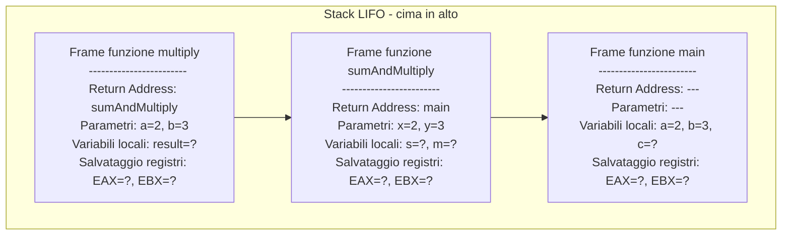

# Introduzione

## Cos’è un computer

* Un computer esegue istruzioni seguendo **sequenze precise**
* Tre componenti principali:

  1. **CPU (Central Processing Unit)** → esegue operazioni aritmetiche/logiche
  2. **Memoria** → contiene dati e programma
  3. **Periferiche** → tastiera, schermo, dischi…
* Quando scriviamo codice C, ogni riga viene tradotta in una serie di operazioni hardware

---

## Registri CPU

* I registri sono **memoria velocissima dentro la CPU**, molto più rapida della RAM
* Funzioni principali:

  * Contengono dati temporanei per operazioni
  * Memorizzano risultati intermedi
* Tipi principali:

  * **Registri generali:** EAX, EBX, RAX, RBX… (usati per calcoli)
  * **Stack pointer (SP):** indica la cima dello stack
  * **Base pointer (BP / EBP / RBP):** punto di riferimento per variabili locali e parametri
  * **Instruction pointer (IP / RIP):** indica la prossima istruzione da eseguire

---

## Dal codice C all’istruzione macchina

```c
int a = 5;
int b = 10;
int c = a + b;
```

* Passaggio del compilatore:

  1. C → **Assembly** (istruzioni simboliche vicine al processore)
  2. Assembly → **istruzioni macchina** 

* Per esempio, su x86_64:

```asm
mov eax, 5    ; metti 5 in registro EAX
mov ebx, 10   ; metti 10 in registro EBX
add eax, ebx  ; somma EAX + EBX → risultato in EAX
```

* Ogni istruzione sarà eseguita dal **ciclo fetch-decode-execute**

---

## Ciclo fetch-decode-execute

1. **Fetch:** CPU legge l’istruzione dalla memoria (RAM o cache L1)
2. **Decode:** l’unità di controllo interpreta cosa fare
3. **Execute:** ALU o unità di controllo esegue operazione (somma, confronto, spostamento)
4. **Write-back:** risultato scritto in registro o memoria

**Esempio concreto:**

* `c = a + b;`

  1. Fetch: prendi `add eax, ebx`
  2. Decode: istruzione di somma tra registri
  3. Execute: ALU calcola 5 + 10
  4. Write-back: risultato (15) in EAX

---

## Memoria

```text
+---------------------------+  <- Indirizzi alti
| Stack                     |
|  - Record di attivazione  |
|  - Variabili locali       |
|  - Indirizzo di ritorno   |
+---------------------------+
| Heap                      |  
|  - Memoria dinamica       |
|  - malloc/free            |
+---------------------------+
| Dati statici / globali    |
|  - Variabili globali      |
|  - Variabili statiche     |
+---------------------------+
| Codice / text             |
|  - Istruzioni macchina    |
+---------------------------+  <- Indirizzi bassi

```


## Stack

* Memoria **automatica e temporanea**
* Contiene **stack** di record di attivazione

* Contenuto di un record di attivazione:

  1. **Parametri della funzione**
  2. **Indirizzo di ritorno:** dove tornare al termine della funzione
  3. **Variabili locali**
  4. (Opzionale) salvataggio dei registri usati

```c++
#include <stdio.h>

int multiply(int a, int b) {
    int result = a * b;
    return result;
}

int sumAndMultiply(int x, int y) {
    int s = x + y;
    int m = multiply(x, y);
    return s + m;
}

int main() {
    int a = 2;
    int b = 3;
    int c = sumAndMultiply(a, b);
    printf("%d\n", c);
    return 0;
}
```



---

## Heap – Memoria dinamica

* L’heap è una **zona della RAM** dove il programmatore può allocare memoria **durante l’esecuzione del programma**.
* A differenza dello **stack**, la memoria allocata nell’heap **non viene rimossa automaticamente** quando una funzione termina.
* Viene utilizzata per:

  * Dati di **grande dimensione**
  * Strutture con **durata variabile**
  * Strutture che devono sopravvivere alla funzione che le ha create (es. array dinamici, liste collegate, oggetti complessi)

--- 

```c
#include <stdio.h>
#include <stdlib.h>

int main() {
    int* array = (int*) malloc(5 * sizeof(int));  // allocazione di 5 interi
    if (array == NULL) {
        printf("Errore allocazione memoria\n");
        return 1;
    }

    for(int i=0; i<5; i++) {
        array[i] = i * 2;  // scrive direttamente in heap
    }

    free(array);  // libera la memoria
    return 0;
}
```

* `malloc` chiede alla RAM uno spazio di 5 interi
* La CPU riceve un **indirizzo di partenza** nello heap e lo salva nel puntatore `array` nello stack
* Accesso: `array[i]` → la CPU calcola l’indirizzo relativo all’inizio dell’heap e legge/scrive i valori
* `free(array)` libera la memoria per riutilizzo futuro

---

```
Stack:
+-----------------+
| Record main()   |
| array (puntatore) --> indirizzo heap
+-----------------+

Heap:
+-------------------------+
| array[0]                |
| array[1]                |
| array[2]                |
| array[3]                |
| array[4]                |
+-------------------------+
```

* Lo **stack** contiene il puntatore `array` (indirizzo iniziale dello heap)
* Lo **heap** contiene i dati reali (array di 5 interi)
* La CPU accede alla memoria **usando il puntatore nello stack** come base

---

## Puntatori e indirizzi

* Un puntatore è una **variabile che contiene un indirizzo di memoria**.
* Invece di contenere direttamente un valore (come `int a = 5`), contiene **l’indirizzo di un’altra variabile**.
* Permette di leggere o scrivere **direttamente in memoria**, come farebbe la CPU.

```c
int a = 5;      // variabile normale
int* p = &a;    // p contiene l'indirizzo di a
*p = 10;        // scrive direttamente a quell'indirizzo
```

1. La CPU alloca `a` nello **stack**.
2. La CPU alloca `p` nello stack, e vi scrive **l’indirizzo di `a`**.
3. Quando esegue `*p = 10;`:

  * La CPU legge l’indirizzo memorizzato in `p`.
  * Va alla RAM nello **stack** all’indirizzo di `a`.
  * Scrive il valore `10` in quella cella.

Dopo questa operazione, la variabile `a` vale `10`.

```
Stack:
+-------+
| a = 10|  <- indirizzo: 0x7ffee...
+-------+
| p     |  <- contiene: 0x7ffee... (indirizzo di a)
+-------+

Operazione *p = 10:
1. CPU legge p → ottiene 0x7ffee...
2. Scrive 10 nell'indirizzo 0x7ffee...
3. a vale ora 10
```

---

## Il linguaggio C
È un linguaggio di programmazione general-purpose progettato inizialmente da Dennis Ritchie dei Bell Laboratories e implementato nel 1972. Inventato per sopperire ai limiti del linguaggio B e BCPL.

Viene considerato un linguaggio di **basso livello**:
* Linguaggi di **alto livello**: gestione automatica della memoria, oggetti, stream, stringhe, collections...). Esempi: Python, Java, Javascript, C#, Dart, Kotlin
* Linguaggi di **basso livello**: gestione manuale della memoria e astrazioni semplici (tipi di dati, funzioni,
  strutture dati), parziale visibilità architetturale. Esempi: C, Rust
* Linguaggi di **bassissimo livello**: programmi scritti specificamente per un tipo di architettura hardware. Esempi: assembly, VHDL

I linguaggi sono creature vive e vengono migliorati periodicamente. La possibilità di utilizzare certe funzionalità del C dipende strettamente dal supporto del compilatore:

  * 1973: invenzione del linguaggio C da parte di Rennis Ritchie
  * 1983: National Standard Institute (ANSI) inizia la definizione di ANSI C o C standard
  * 1989: definizione dello standard [C89](https://en.wikipedia.org/wiki/ANSI_C#C89) 
  * 1999: definizione dello standard [C99](https://en.wikipedia.org/wiki/C99) 
  * 2011: definizione dello standard [C11](https://en.wikipedia.org/wiki/C11_(C_standard_revision))
  * 2018: definizione dello standard [C17](https://en.wikipedia.org/wiki/C17_(C_standard_revision))


## Caratteristiche del C

E' la lingua franca per gli sviluppatori. Implementazioni di nuovi algoritmi, ad esempio, sono spesso divulgate inizialmente solo in C. E' anche il linguaggio in cui si descrive spesso il comportamento della macchina. **Evita superstizione!**

Il linguaggio è pensato per essere **efficiente**: lo sviluppatore ha il controllo completo su quello che succede. Tuttavia: commettere errori è facile e subdolo: il compilatore non rileva gli errori con la completezza delle alternative più recenti (Java o Python). Inoltre, gli errori possono produrre conseguenze gravi in termini di sicurezza e integrità del sistema non esistendo una virtual machine (*sandbox*).

* **Procedurale**: il programma è un insieme di *procedure* (funzioni). Non esiste supporto a strutture modulari più complesse come classi ed oggetti.
* **Compilato**: il codice sorgente deve essere trasformato in linguaggio macchina da un compilatore (e.g., gcc) *prima di essere eseguito*.
* **Tipizzato**: ogni variabile ha un tipo associato, lo sviluppatore deve sempre dichiarare il tipo prima di usare la variabile. E' però possibile utilizzare tipi alternativi per accedere al dato (i.e., lascamente tipizzato).


## Ambito di utilizzo del C

* Sistemi Operativi (e.g., kernel Windows/Linux/Mac/IoS/Android)
* Sistemi embedded (e.g., Arduino)
* Database (e.g., MySQL, MS SQL Server, and PostgreSQL)
* Linguaggi di programmazione (e.g., Python)
* Librerie e routine ad alte performance (e.g., numpy, webassembly)
* Motori grafici 3D (e.g., Unreal Engine C++)
* Software per telecomunicazioni (e.g., openWrt)
* Software di controllo per processi industriali (e.g., PLC)


## Ambienti di sviluppo
*Gli ambienti di sviluppo integrato – o IDE, Integrated Development Environment – sono strumenti fondamentali per il lavoro di un programmatore. Esistono una varietà di ambienti di sviluppo, dai più complessi ed articolati, fino a semplici editor di testo affiancati ad un compilatore.*

* CLion
* Visual Studio
* Eclipse
* Sublime text
* Vim


## Funzione *main()*
L'esecuzione di un programma C inizia sempre dalla prima istruzione della funzione *main*. La funzione *main* accetta argomenti (per ora ignorati) e ritorna un numero intero. Il programma termina quando la funzione *main* termina.

**Linea 3**: *int* tipo del valore di ritorno della funzione, *main* nome della funzione, *{* inizio del corpo della funzione. La funzione termina a linea 6 *}*.

**Linea 4**: *printf* invocazione della funzione di libreria printf(), che riceve come argomento la stringa costante *Hello, World!* terminata con carattere a capo *\\n*.

**Linea 5**: *return* istruzione che termina la funzione e ritorna *0* (successo in ambito Unix). 

```c++
#include <stdio.h>

int main() {
  printf("Hello, World!\n");
  return 0;
}
```

## Commenti

I commenti sono porzioni di testo che non vengono considerate dal compilatore (i.e., vengono eliminati dal preprocessore). Sono fondamentali per rendere leggibile il codice e promuovere la collaborazione fra più sviluppatori.

Come regola generale, è preferibile un commento descrittivo all'inizio di ogni funzione piuttosto che commenti brevi e sparsi.

```c++
/*
 * Questo è un commento multi-linea
 * che descrive la funzione sottostante
 */
int sum(int a, int b) {
    // Questo è un commento singola-linea
}
```

## Parole chiave
| **Parole chiave** | **Utilizzo** |
| ----------------- | ------------ |
| break case continue default do else for goto if return switch while | costrutti di controllo |
| char double enum float int long short signed struct union unsigned void | tipi di dato semplice |
| auto const extern register static volatile | modificatori di volatività e persistenza |
| sizeof | operatore che ritorna la dimensione di una varibile |
| typedef | definizione di tipi definiti dall'utente |


## Identificatori
In C un identificatore è un nome che si riferisce a funzioni, variabili, etc. definiti nel codice. 

* Non può essere una parola chive del linguaggio
* Non può cominciare con un numero
* Può contenere qualsiasi combinazione di:
  * lettere maiuscole e minuscole
  * numeri
  * il carattere underscore (_)

Esempi **validi**: prova1, prova_1, media_pesata, _tot

Esempi **invalidi**: 1_prova, totale_%, typedef


## Variabili
Una variabile è una porzione di memoria che contiene dei dati che possono essere modificati durante l'esecuzione. Ogni variabile deve essere **dichiarata**, ovvero:
* associata a un identificatore;
* associata a un tipo.

```c++
#include <stdio.h>

int main() {
    int a, b, somma;
    
    a = 10;
    b = 12;
    somma = a + b;
    printf("somma=%d\n", somma);
    return 0;
}
```


Utilizzare [PythonTutor](https://pythontutor.com/) oppure il debugger integrato per visualizzare lo stato delle variabili.

## Espressioni
*Un programma C e' una sequenza di espressioni. Le espressioni sono combinazioni di variabili, costanti, chiamate a funzione, e operatori*.

Non esiste in C una reale delimitazione fra espressioni logiche e aritmetiche in quanto *0* è considerato equivalente al valore logico *falso*, mentre *1* è considerato equivalente al valore logico *vero*.

Ad esempio:

```c++
45 * (a + b)
delta * sqrt(abs(x1 * x2))
sqrt(a * b - c) <= 10
(c1 || c2) && c3
max = a > b ? a : b
a % b
```
