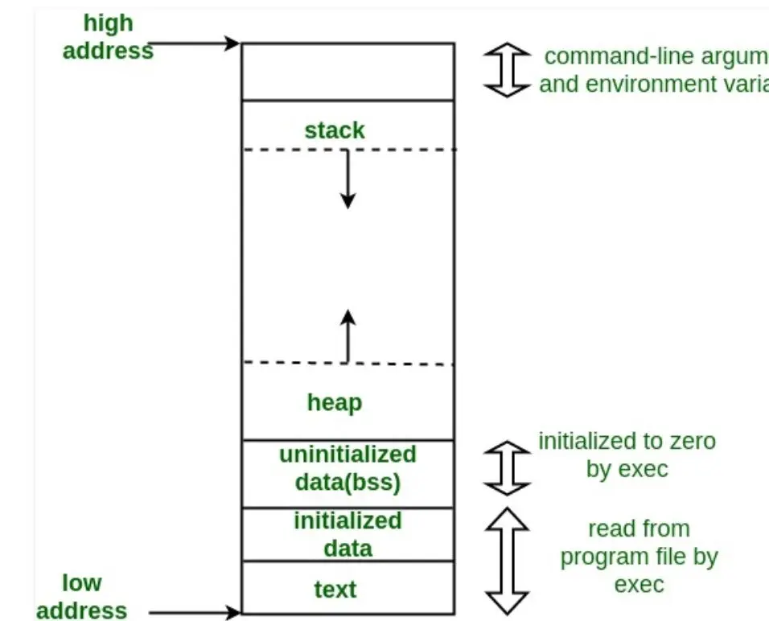

# Puntatori

## Operazioni bit a bit

| Operator | Name             | Description                             |
|----------|------------------|-----------------------------------------|
| `&`      | AND              | Sets bit to 1 if **both** bits are 1    |
| \|       | OR               | Sets bit to 1 if **at least one** is 1  |
| `^`      | XOR              | Sets bit to 1 if bits are **different** |
| `~`      | NOT (Complement) | Inverts all bits                        |
| `<<`     | Left Shift       | Shifts bits left (multiplies by 2ⁿ)     |
| `>>`     | Right Shift      | Shifts bits right (divides by 2ⁿ)       |


### Examples

```c
int a = 6;    // 00000110
int b = 3;    // 00000011

a & b   → 2   // 00000010
a | b   → 7   // 00000111
a ^ b   → 5   // 00000101
~a      → -7  // 11111001 (in 8-bit 2's complement)
a << 1  → 12  // 00001100
a >> 1  → 3   // 00000011
```

### Use Cases

- Checking if a bit is set: `(a & (1 << n))`

```
a               10101010
1 << 3          00001000
a & (1 << 3)	10101010 & 00001000 = 00001000 (non-zero)
```

- Setting a bit: `a |= (1 << n)`

```
a               10101010
1 << 3          00001000
a | (1 << 3)    10101010 | 00001000 = 10101010  (bit 3 was already set)
```

- Clearing a bit: `a &= ~(1 << n)`

```
a               10101010
1 << 3          00001000
~(1 << 3)       11110111
a & ~(1 << 3)   10101010 & 11110111 = 10100010  (bit 3 is now cleared)
```

- Toggling a bit: `a ^= (1 << n)`

```
a               10101010
1 << 3          00001000
a ^ (1 << 3)    10101010 ^ 00001000 = 10100010  (bit 3 flipped from 1 to 0)
```

## Puntatori a void
La parola chiave *void* può essere usata per dichiarare dei puntatori che non puntano a nessun tipo di dato in particolare. 
* È sempre consentito l'assegnamento di un puntatore a *void* a qualunque altro tipo di puntatore. 
* Lo è pure l'assegnamento di qualunque puntatore a un puntatore a *void*
* L'assegnamento tra puntatori di tipi diversi da void causa messaggi di warning. 
  
```c
void *ptr;
int *i;
float *f;

i = ptr;
ptr = i;

/* Incompatible pointer types assigning to 'int *' from 'float *' */
i = f;
```

Puntatori a *void* possono essere anche utilizzati per operazioni bit a bit in cui il tipo di dato non è rilevante.

```c++
void stampa_bit(void *ptr) {
  unsigned char *byte_ptr = (unsigned char *)ptr;
  int i, j;

  printf("%p ", ptr);
  for (i = 3; i >= 0; i--) { // assuming 4 bytes (32 bits)
    for (j = 7; j >= 0; j--) { // 8 bits
      printf("%d", (byte_ptr[i] >> j) & 0x00000001);
    }
  }
  printf("\n");
}

int main(void) {
  int ints[] = {0, 1, -1, 16, -16};
  float f;

  for (int i = 0; i < 5; i++) {
    printf("%d ->   ", ints[i]);
    stampa_bit((void *)&ints[i]);

    f = (float)ints[i];
    printf("%.1f -> ", f);
    stampa_bit((void *)&f);
  }
}
```

```
0     -> 0x7fff23e60f80 00000000000000000000000000000000
0.0   -> 0x7fff23e60f78 00000000000000000000000000000000
1     -> 0x7fff23e60f84 00000000000000000000000000000001
1.0   -> 0x7fff23e60f78 00111111100000000000000000000000
-1    -> 0x7fff23e60f88 11111111111111111111111111111111
-1.0  -> 0x7fff23e60f78 10111111100000000000000000000000
16    -> 0x7fff23e60f8c 00000000000000000000000000010000
16.0  -> 0x7fff23e60f78 01000001100000000000000000000000
-16   -> 0x7fff23e60f90 11111111111111111111111111110000
-16.0 -> 0x7fff23e60f78 11000001100000000000000000000000
```


## Aritmetica dei puntatori
Ai puntatori possono essere sommati e sottratti numeri interi. Il risultato della somma di un puntatore e di un numero intero è l'indirizzo dell'elemento n-esimo dell'array. 

Il valore numerico del puntatore (indirizzo in memoria espresso in byte) viene incrementato/decrementato **non di 1**, ma della dimensione di un oggetto puntato!

```c++
int main(void) {
  int i, v[] = {0, 1, 2, 3, 4, 5, 6, 7, 8, 9};
  int *p = v;

  for (i = 0; i < 10; i++) {
    printf("[%d] %d %d %d\n", i, v[i], *(v + i), *(p + i));
  }

  for (i = 0; i < 10; i++, p++) {
    printf("[%d] %d %d %d\n", i, v[i], *(v + i), *p);
  }
}
```

Nell'esempio seguente viene stampata una stringa, carattere per carattere, utilizzando un puntatore. 

```c++
char string[] = "hello world!";
char *p;

// prints "hello world!" letter by letter
for (p = string; *p; p++) {
    printf("%c", *p);
}
```

Nota bene:
* Il puntatore *p* è utilizzato per scorrere l'array (inizializzato all'indirizzo del primo elemento).
* Il ciclo termina quando il valore puntato \*p, è nullo (il valore 0 equivale alla condizione logica *falso*).
* L'unico valore di *v* con valore zero deve essere ultimo, altrimenti il puntatore assumerà valori non validi andando ad accedere oltre la fine dell'array oppure il ciclo terminerà in modo prematuro. Approccio seguito nella gestione delle stringhe ma **non adatto** a vettori numerici.


È anche possibile **eseguire la differenza (ma non la somma!) tra puntatori** dello stesso tipo:
* Il risultato della differenza fra puntatori è un numero intero che rappresenta **il numero di elementi** (non di bytes!) che separano i due puntatori
* La dimensione di un singolo elemento è quella definita dal tipo di dato puntato

```c++
int main(void) {
    int *p, *q, v[] = {0, 1, 2, 3, 4, 5, 6, 7, 8, 9};

    p = v;
    
    q = p + 2;
    printf("%ld\n", q - p);     /* Output: 2 */
    printf("%d %d\n", *p, *q);  /* Output: 0 2 */

    q = p + 4;
    printf("%ld\n", q - p);     /* Output: 4 */
    printf("%d %d\n", *p, *q);  /* Output: 0 4 */
}
```


### Recap
Gli operatori fondamentali per usare i puntatori sono elencati di seguito:

* \* (da leggere *il valore puntato da*)
* & (da leggere *l'indirizzo di*)
* [] accedo a un elemento particolare di un array
* Si noti che \*p == p[0], \*(p+i) == p[i]

```c
int i;
int v[10];
int *p;

p = v;      /* p punta ad indice 0 di v */
p = &v[0];  /* p punta ad elemento con indice 0 di v */
p = &v[4];  /* p punta ad elemento con indice 4 di v */
p = v + 4;  /* p punta ad elemento con indice 4 di v */
p++;        /* p punta ad elemento con indice 5 di v */
i = p - v;  /* i == 5 */
```

## Puntatori e stringhe
Vettori e puntatori sono concetti affini, ma esistono sottili differenze:
  * *sizeof* si comporta in modo diverso. Ritorna la dimensione dell'array o la dimensione del puntatore
  * *&* si comporta in modo diverso. Ritorna l'indirizzo del primo elemento o l'indirizzo del puntatore
  * I puntatori possono contenere indirizzi variabili nel corso dell'esecuzione, mentre i vettori rappresentano *indirizzi costanti* (non è possibile modificare l'indirizzo a un array!)
  * Le stringhe memorizzate in un array possono essere modificate in ogni momento o accedendo ai singoli elementi oppure tramite apposite funzioni (e.g., *strcpy*). Le stringhe memorizzate attraverso puntatore sono invece memorizzate in aree di memoria in *sola lettura*

  
```c++
int main(void) {
    char s1[] = "Hello World!";
    char *s2 = "Hello World!";

    s1[0] = 'a';    /* OK */
    s2[0] = 'a';    /* Errore a runtime */

    s2 = s1;        /* OK */
    s1 = s2;        /* Errore in compilazione */

    printf("%lu %lu\n", sizeof(s1), sizeof(s2));    /* Output: 13 8 */
}
```

```c++
char s1[] = "prova";
char s2[] = {'p', 'r', 'o', 'v', 'a', '\0'};
char c, *t;

c = *s1;        /* c == 'p' */
t = s1 + 2;     /* t contine indirizzo del carattere 'o' */

s1[0] = *t;     /* s1 == "orova" */

t++;            /* t contine indirizzo del carattere 'v' */

s1++;           /* errore in compilazione */
```

L'esempio seguente mostra un possibile utilizzo dell'aritmetica dei puntatori al fine di calcolare la lunghezza di una stringa *zero-terminata*:

```c++
unsigned str_len(char *ptr) {
    unsigned size = 0;

    for (; *ptr; ptr++) size++;
    return size;
}

int main(void) {
    char s[] = "prova";
    printf("%u\n", str_len(s));
}
```

L'esempio seguente mostra come manipolare un array di puntatori a carattere (i.e., un array di stringhe) utilizzando un *puntatore a puntatore a carattere*. Si tratta di una variabile puntatore che contiene l'indirizzo di una seconda variabile puntatore.


```c++
int main(void) {
    int i;
    char *nomi[] = {
            "Sara", 
            "Sebastiano", 
            "Paolo", 
            "Agostino", 
            "Elvira", 
            NULL
    };
    char **p;

    for (i = 0; i < 5; i++) {
        printf("[%d] %s\n", i, nomi[i]);
    }

    for (i = 0; i < 5; i++) {
        printf("[%d] %s\n", i, *(nomi + i));
    }

    i = 0;
    for (p = nomi; *p; p++) {
        printf("[%d] %s\n", i++, *p);
    }
}
```


```c++
int main(void) {
    char *nomi[] = {
            "Sara", 
            "Sebastiano", 
            "Paolo", 
            "Agostino", 
            "Elvira", 
            NULL
    };
    char **p = nomi;

    /* Indirizzo del primo puntatore a carattere */
    printf("%p %p %p\n", nomi, &nomi[0], p);

    /* Indirizzo del secondo puntatore a carattere */
    printf("%p %p %p\n", nomi + 1, &nomi[1], p + 1);

    /* Indirizzo del primo carattere della prima stringa */
    printf("%p %p\n", &nomi[0][0], *p);

    /* Valore del primo carattere della prima stringa */
    printf("%c %c\n", nomi[0][0], **p);
}
```


## L'allocazione dinamica della memoria
Il linguaggio C permette di effettuare l'allocazione di memoria anche durante l'esecuzione del programma, sulla base di opportune condizioni che possono verificarsi durante l'esecuzione.

Questo tipo di allocazione di memoria è detta dinamica (*heap*), proprio perché avviene dinamicamente durante l'esecuzione. L'allocazione cosiddetta statica (*stack*) è quella che invece viene effettuata dal compilatore dopo la dichiarazione delle variabili.



Il tempo di vita di porzioni di memoria allocate dinamicamente **non dipende** da quello della funzione in cui l'allocazione avviene! Di seguito alcune funzioni di libreria da utilizzare per questo scopo.

```c++
#include <stdlib.h>
void *malloc(size_t size);
void *calloc(size_t nmemb, size_t size);
void *realloc(void *ptr, size_t size);
free(void *ptr);
```

```c++
#include <string.h>
void *memset(void *ptr, int c, size_t size)
void *memcpy(void *destination, const void *source, size_t size);
void *memmove(void *destination, const void *source, size_t size)
```

### malloc()

```c++
void *malloc(size_t size);
```

*malloc* (Memory ALLOCation) richiede come argomento il numero di byte da allocare in memoria:
* Restituisce l'indirizzo al quale la memoria è stata allocata
* Restituisce NULL se non è stato possibile allocare la memoria
* *Lo spazio allocato in memoria è contiguo*

```c++
int *p;
/* Dipendente dal tipo di dato */
p = malloc(10 * sizeof(int));

/* Indipendente dal tipo di dato, da preferire */
p = malloc(10 * sizeof(*p));    
```

Nell'esempio precedente viene allocato lo spazio necessario per memorizzare 10 valori interi contigui, uno spazio di memoria che può quindi essere acceduto come fosse un array.

È possibile utilizzare il puntatore tramite indici (notazione []) per accedere alla memoria allocata:

```c++
int *p;
p = malloc(10 * sizeof(*p));

if (!p) {
    /* gestione dell'errore */
}

for (int i = 0; i < 10; i++) {
    p[i] = i;
    /* oppure *(p + i) = i; */
}
```

### calloc(), realloc()

```c++
void *calloc(size_t nmemb, size_t size);
```
*calloc* alloca un puntatore a un blocco di memoria in grado di contenere un array di *nmemb* elementi ciascuno dei quali ha dimensione *size*. Il blocco di memoria viene inizializzato a 0 byte per byte.

```c++
int main(void) {
    int i, *p;

    p = calloc(10, sizeof(*p));
    
    // stampa solo zeri
    for (i = 0; i < 10; i++) {
        printf("%d\n", p[i]);
    }
}
```

```c++
void *realloc(void *ptr, size_t size);
```
*realloc* ridimensiona a *size* un blocco di memoria già allocato e puntato da *ptr*. Preserva il contenuto della memoria già allocata e non inizializza il blocco di memoria aggiuntivo.

*In caso \*p sia un puntatore non allocato o su cui è già stata chiamata free(), il comportamento è non definito*

Nell'esempio seguente viene allocato dinamicamente (e inizializzato a 0) lo spazio necessario a contenere 10 interi. Successivamente, lo spazio allocato viene allargato per contenere 20 interi e la memoria aggiuntiva viene, a sua volta, inizializzata a 0.

```c++
int main(void) {
    int i, *p;

    p = calloc(10, sizeof(*p));
    for (i = 0; i < 10; i++) {
        printf("%d\n", p[i]);
    }

    // inizializza a zero la nuova porzione allocata
    p = realloc(p, 20 * sizeof(*p));
    for (i = 10; i < 20; i++) {
        p[i] = 0;
    }
}
```

### memset(), bzero()

```c++
void *memset(void *str, int c, size_t n);
void *bzero(void *str, size_t n);
```

*memset* e *bzero* scrivono all'interno di un'area contigua di memoria un valore preciso. 
  * *memset* consente di specificarlo
  * *bzero* scrive sempre 0

```c++
/* inizializza un vettore 0 */
for(i = 0; i < 10; i++) {
    p[i] = 0;
}

/* inizializza un vettore 0 */
for (i = 0; i < 10; i++, p++) {
    *p = 0;
}

/* inizializza un vettore 0 (memset) */
memset(p, 0, 10 * sizeof(*p));

/* inizializza un vettore 0 (bzero) */
bzero(p, 10 * sizeof(*p));
```

### free()

```c++
void free(void *ptr);
```

*free* libera il blocco di memoria di indirizzo precedentemente allocato tramite *malloc*, *calloc* o *realloc*. La memoria liberata dall'invocazione di *free* diventa disponibile per altre applicazioni

La memoria allocata dinamicamente deve essere rilasciata quando non è più necessaria, per evitare di occupare inutilmente memoria. Con *memory leak* si intende il mancato utilizzo della funzione *free*. Come conseguenza, il sistema perde memoria disponibile.

```c++
int *p;
p = malloc(10 * sizeof(*p));

if (!p) {
    /* gestione dell'errore */
}

free(p);
```

### strdup()

Esistono funzioni di libreria che utilizzano *malloc* per svolgere i loro compiti:

```c++
char *strdup(const char *s);
```
  
*strdup* (STRing DUPlicate) dichiarata in *string.h*, ritorna un puntatore a una nuova stringa che è un duplicato
  della stringa *s* passata come parametro.

La funzione, al suo interno, alloca memoria per la nuova stringa con *malloc*. Quando la copia generata non viene più utilizzata, la memoria deve essere esplicitamente liberata con *free*.

Il manuale di *strdup()* riporta testualmente: *The strdup() function returns a pointer to a new string which is a duplicate of the string s.  Memory for the new string is obtained with malloc(3), and can be freed with free(3).*

```c++
#include <stdio.h>
#include <stdlib.h>
#include <string.h>

int main(void) {
    char *str = "hello world!";
    char *str_copy = strdup(str);

    printf("%s %s\n", str, str_copy);

    free(str_copy);
    
    /* error: pointer being freed was not allocated */
    free(str);
}
```

## Dangling references

Un puntatore *dangling* è puntatore che punta a un'area di memoria non valida.

```c++
int main(void) {
  /* allocazione della memoria */
  int *p = malloc(sizeof(*p));

  /* impiego dell'area allocata */
  *p = 57;

  /* deallocazione memoria */
  free(p);

  /* Errore! Dangling Reference
   * L'area di memoria puntata da p non e' piu' disponibile !!!! */
  *p = 20;

  /* Non accedo alla memoria puntata da p
   * Accedo a p e lo faccio puntare a NULL */
  p = NULL;
}
```

Nell'esempio seguente, viene ritornato l'indirizzo di una variabile memorizzata nella porzione di stack riservata alla funzione *func*. Sfortunatamente, quella porzione di memoria viene resa disponibile non appena la funzione *func* termina. Questa circostanza genera un warning in compilazione.

```c++
int *func(void) {
    int n = 13;
    return &n;
}

int main(void) {
    int *p;

    p = func();
    printf("%d\n", *p);
}
```

L'esempio seguente mostra un *memory leak*. Questo problema avviene quando, per un qualsiasi motivo, viene perso l'indirizzo di un'area di memoria ancora allocata. L'area di memoria interessata non è piu' referenziabile e nemmeno deallocabile!

```c++
int *p1, *p2;               /* definizione di 2 puntatori a intero */

p1 = malloc(sizeof(*p1));   /* alloco 1^ area di memoria */
p2 = malloc(sizeof(*p2));   /* alloco 2^ area di memoria */

/* 
 * Errore! p2 punta all'area di memoria di p1!
 * Non posso piu' accedere alla memoria allocata con la seconda malloc() 
 */
p2 = p1;                            
```

## Allocazione dinamica e matrici
È possibile allocare dinamicamente matrici (array bi-dimensionali), utilizzando sia un singolo puntatore (type *matrix) che un puntatore a puntatore (type **matrix)
* Il primo approccio (singolo puntatore) è semplice, immediato, ma impedisce uso di indicizzazione esplicita (matrix[i][j]) e necessita di calcolo manuale dell'offset (offset = i * cols + j)
* Il secondo approccio (puntatore a puntatore) richiede un meccanismo più complesso per allocare e disallocare la memoria, ma consente l'uso di indicizzazione esplicita (matrix[i][j])


### Allocazione dinamica e matrici (singolo puntatore)

```c++
int *allocate_matrix(unsigned rows, unsigned cols) {
    int *m;

    m = malloc((unsigned long)(rows * cols) * sizeof(*m));
    return m;
}

void show_matrix(unsigned rows, unsigned cols, int *m) {
    unsigned i, j, offset;
    
    for (i = 0; i < rows; i++) {
        for (j = 0; j < cols; j++) {
            offset = i * cols + j;
            printf("%4d", m[offset]);
        }
        printf("\n");
    }
}

void free_matrix(int *m) {
    free(m);
}

int main(void) {
    int *m;

    m = allocate_matrix(3, 2);
    if (m == NULL) {
        /* allocation error */
    }
    
    show_matrix(3, 2, m);
    
    free_matrix(m);
}
```

### Allocazione dinamica e matrici (doppio puntatore)

```c++
int **allocate_matrix(unsigned rows, unsigned cols) {
    unsigned i;
    int **m;

    m = malloc((unsigned long)(rows) * sizeof(*m));
    if (m == NULL) return NULL;
    for (i = 0; i < rows; i++) {
        m[i] = malloc((unsigned long)(cols) * sizeof(**m));
        if (m[i] == NULL) return NULL;
    }
    return m;
}

void show_matrix(unsigned rows, unsigned cols, int **m) {
    unsigned i, j;
    for (i = 0; i < rows; i++) {
        for (j = 0; j < cols; j++) {
            printf("%4d", m[i][j]);
        }
        printf("\n");
    }
}

void free_matrix(unsigned rows, unsigned cols, int **m) {
    unsigned i;
    for (i = 0; i < rows; i++) {
        free(m[i]);
    }
    free(m);
}

int main(void) {
    int **m;
    m = allocate_matrix(3, 2);
    if (m == NULL) {
        /* allocation error */
    }

    show_matrix(3, 2, m);

    free_matrix(3, 2, m);
}
```

## Allocazione dinamica e strutture
Nel caso di oggetti relativamente complessi come le matrici, in cui i dati veri e propri (il contenuto della matrice) è sempre abbinato a informazioni aggiuntive come ad esempio il numero di righe e di colonne, l'utilizzo di strutture (aggregazione di aspetti diversi della stessa entità) è consigliabile!

```c++
struct matrix {
    size_t rows, cols;
    double **data;
};

struct matrix *allocate_matrix(size_t rows, size_t cols) {
    struct matrix *m;
    size_t i;

    m = malloc(sizeof(*m));
    m->rows = rows;
    m->cols = cols;
    m->data = malloc((unsigned long) (rows) * sizeof(*(m->data)));
    if (m == NULL) return NULL;

    for (i = 0; i < rows; i++) {
        m->data[i] = malloc((unsigned long) (cols) * sizeof(**(m->data)));
        if (m->data[i] == NULL) return NULL;
    }

    return m;
}

void show_matrix(const struct matrix *m) {
    size_t i, j;
    for (i = 0; i < m->rows; i++) {
        for (j = 0; j < m->cols; j++) {
            printf("%8.2lf", m->data[i][j]);
        }
        printf("\n");
    }
}

void free_matrix(struct matrix *m) {
    size_t i;
    for (i = 0; i<m->rows; i++) {
        free(m->data[i]);
    }
    free(m->data);
    free(m);
}

int main(void) {
    struct matrix *m;

    m = allocate_matrix(3, 2);
    if (m == NULL) {
        /* allocation error */
    }

    show_matrix(m);

    free_matrix(m);
}
```

## Puntatori a funzione
In C, così come il nome di un array è un puntatore al suo primo elemento, il nome di una funzione è un puntatore alla funzione stessa. Il C permette la manipolazione esplicita dei puntatori a funzione. 

Data la funzione *f()*: 

```c++
int f(short, double) {}
```

Allora il nome f è un puntatore di tipo:

```c++
int (*)(short, double)
```

Dichiarando un puntatore dello stesso tipo, si può effettuare, ad esempio, un assegnamento:

```c++
int (*ptr_to_f)(short, double);     /* ptrtof puntatore a funzione */
ptr_to_f = f;                       /* assegna indirizzo di f a ptrtof */
(*ptr_to_f)(2,3.14);                /* invoca f attraverso un puntatore */
```

Si presti attenzione alla sintassi: 

```c++
int *f(int);
```

dichiara il prototipo di una funzione che restituisce un puntatore a intero. 

```c
int (*f)(int);
```

dichiara un puntatore a una funzione che riceve e ritorna un intero.

## Allocazione dinamica, strutture, e puntatori a funzione
È possibile utilizzare questa tecnica per dotare le strutture C anche di funzioni. In questo modo, abbinando informazioni (dati) a comportamenti (funzioni) all'interno della stessa struttura è possibile programmare *quasi a oggetti* anche in C. Infatti, una struttura dotata sia di dati che di funzioni diventa molto simile a una classe Java o C++.

```c++
struct matrix {
    size_t rows, cols;
    double **data;
    size_t (*get_rows)(const struct matrix *m);
    size_t (*get_cols)(const struct matrix *m);
};

size_t get_rows_impl(const struct matrix *m) {
    return m->rows;
}

size_t get_cols_impl(const struct matrix *m) {
    return m->cols;
}

struct matrix *allocate_matrix(size_t rows, size_t cols) {
    struct matrix *m;
    size_t i;

    m = malloc(sizeof(*m));
    m->rows = rows;
    m->cols = cols;
    m->get_rows = get_rows_impl;
    m->get_cols = get_cols_impl;
    m->data = malloc((unsigned long) (rows) * sizeof(*(m->data)));
    if (m == NULL) return NULL;

    for (i = 0; i < rows; i++) {
        m->data[i] = malloc((unsigned long) (cols) * sizeof(**(m->data)));
        if (m->data[i] == NULL) return NULL;
    }

    return m;
}

void show_matrix(const struct matrix *m) {
    size_t i, j;
    for (i = 0; i < m->rows; i++) {
        for (j = 0; j < m->cols; j++) {
            printf("%8.2lf", m->data[i][j]);
        }
        printf("\n");
    }
}

void free_matrix(struct matrix *m) {
    size_t i;
    for (i = 0; i<m->rows; i++) {
        free(m->data[i]);
    }
    free(m->data);
    free(m);
}

int main(void) {
    struct matrix *m;

    m = allocate_matrix(3, 2);
    if (m == NULL) {
        /* allocation error */
    }

    printf("Matrix 'm' has size [%d, %d]\n", m->get_rows(m), m->get_cols(m));

    show_matrix(m);

    free_matrix(m);
}
```